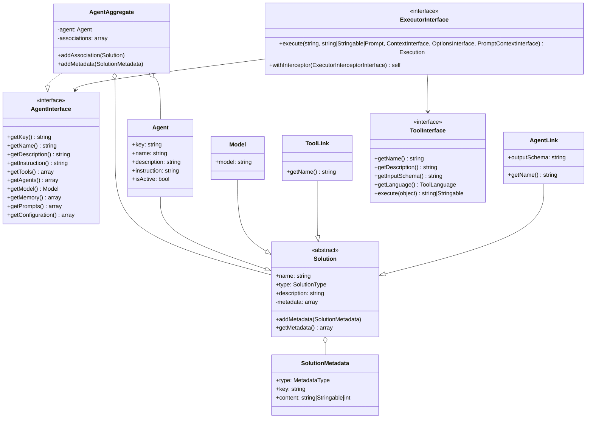

<p align="center">
    <br>
    <a href="https://github.com/llm-agents-php" target="_blank">
        <picture>
            <source media="(prefers-color-scheme: dark)" srcset="https://raw.githubusercontent.com/llm-agents-php/.github/master/assets/logo.png">
            
        </picture>
    </a>
    <br>
</p>

# LLM Agents PHP SDK

LLM Agents is a powerful PHP library for building and managing Language Model (LLM) based agents. This package provides
a flexible and extensible framework for creating autonomous agents that can perform complex tasks, make decisions, and
interact with various tools and APIs.

> There is an article on Medium where I explaind what is LLM agents: [A PHP dev’s dream: An AI home that really gets you
](https://butschster.medium.com/a-php-devs-dream-an-ai-home-that-really-gets-you-dd97ae2ca0b0)

[](https://packagist.org/packages/llm-agents/agents)
[](https://packagist.org/packages/llm-agents/agents)
[](https://packagist.org/packages/llm-agents/agents)

> For a complete example with sample agents and a CLI interface to interact with them, check out our sample application
> repository https://github.com/llm-agents-php/sample-app. This sample app demonstrates practical implementations and
> usage patterns of the LLM Agents library.

The package does not include any specific LLM implementation. Instead, it provides a framework for creating agents that
can interact with any LLM service or API.

## ✨ Key Features

- **🤖 Agent Creation:** Create and configure **LLM-based agents** in PHP with customizable behaviors.
- **🔧 Tool Integration:** Seamlessly integrate various tools and APIs for agent use in PHP applications.
- **🧠 Memory Management:** Support for agent memory, enabling information retention and recall across interactions.
- **💡 Prompt Management:** Efficient handling of prompts and instructions to guide agent behavior.
- **🔌 Extensible Architecture:** Easily add new agent types, tools, and capabilities to your PHP projects.
- **🤝 Multi-Agent Support:** Build systems with multiple interacting agents for complex problem-solving scenarios in
  PHP.

## 📀 Installation

You can install the LLM Agents package via Composer:

```bash
composer require llm-agents/agents
```

## 💻 Usage

### → Creating an Agent

To create an agent, you'll need to define its behavior, tools, and configuration. Here's a basic example:

```php
use LLM\Agents\Agent\AgentAggregate;
use LLM\Agents\Agent\Agent;
use LLM\Agents\Solution\Model;
use LLM\Agents\Solution\ToolLink;
use LLM\Agents\Solution\MetadataType;
use LLM\Agents\Solution\SolutionMetadata;

class SiteStatusCheckerAgent extends AgentAggregate
{
    public const NAME = 'site_status_checker';

    public static function create(): self
    {
        $agent = new Agent(
            key: self::NAME,
            name: 'Site Status Checker',
            description: 'This agent checks the online status of websites.',
            instruction: 'You are a website status checking assistant. Your goal is to help users determine if a website is online. Use the provided tool to check site availability. Give clear, concise responses about a site\'s status.',
        );

        $aggregate = new self($agent);

        $aggregate->addMetadata(
            new SolutionMetadata(
                type: MetadataType::Memory,
                key: 'check_availability',
                content: 'Always check the site\'s availability using the provided tool.',
            ),
            new SolutionMetadata(
                type: MetadataType::Configuration,
                key: 'max_tokens',
                content: 500,
            )
        );

        $model = new Model(model: 'gpt-4o-mini');
        $aggregate->addAssociation($model);

        $aggregate->addAssociation(new ToolLink(name: CheckSiteAvailabilityTool::NAME));

        return $aggregate;
    }
}
```

### → Implementing a Tool

Now, let's implement the tool used by this agent:

```php
use LLM\Agents\Tool\PhpTool;
use LLM\Agents\Tool\ToolLanguage;

class CheckSiteAvailabilityTool extends PhpTool
{
    public const NAME = 'check_site_availability';

    public function __construct()
    {
        parent::__construct(
            name: self::NAME,
            inputSchema: CheckSiteAvailabilityInput::class,
            description: 'This tool checks if a given URL is accessible and returns its HTTP status code and response time.',
        );
    }

    public function getLanguage(): ToolLanguage
    {
        return ToolLanguage::PHP;
    }

    public function execute(object $input): string
    {
        $ch = curl_init($input->url);
        curl_setopt_array($ch, [
            CURLOPT_RETURNTRANSFER => true,
            CURLOPT_HEADER => true,
            CURLOPT_NOBODY => true,
            CURLOPT_FOLLOWLOCATION => true,
            CURLOPT_MAXREDIRS => 10,
            CURLOPT_TIMEOUT => 30,
        ]);

        $startTime = microtime(true);
        $response = curl_exec($ch);
        $endTime = microtime(true);

        $statusCode = curl_getinfo($ch, CURLINFO_HTTP_CODE);
        $responseTime = round(($endTime - $startTime) * 1000, 2);

        curl_close($ch);

        $isOnline = $statusCode >= 200 && $statusCode < 400;

        return json_encode([
            'status_code' => $statusCode,
            'response_time_ms' => $responseTime,
            'is_online' => $isOnline,
        ]);
    }
}
```

And the input schema for the tool:

```php
use Spiral\JsonSchemaGenerator\Attribute\Field;

class CheckSiteAvailabilityInput
{
    public function __construct(
        #[Field(title: 'URL', description: 'The full URL of the website to check')]
        public readonly string $url,
    ) {}
}
```

### → Linking Agents

LLM Agents supports creating complex systems by linking multiple agents together. This allows you to build hierarchical
or collaborative agent networks. Here's how you can link one agent to another:

#### Creating an Agent Link

To link one agent to another, you use the `AgentLink` class. Here's an example of how to modify our
`SiteStatusCheckerAgent` to include a link to another agent:

```php
use LLM\Agents\Solution\AgentLink;

class SiteStatusCheckerAgent extends AgentAggregate
{
    public const NAME = 'site_status_checker';

    public static function create(): self
    {
        // ... [previous agent setup code] ...

        // Link to another agent
        $aggregate->addAssociation(
            new AgentLink(
                name: 'network_diagnostics_agent',
                outputSchema: NetworkDiagnosticsOutput::class,
            ),
        );

        return $aggregate;
    }
}
```

In this example, we're linking a `network_diagnostics_agent`. The `outputSchema` parameter specifies the expected output
format from the linked agent. The output schema is used to standardize the data format that should be returned by the
linked agent.

#### Using a Linked Agent

We don't provide an implementation for the linked agent here, but you can use the linked agent in your agent's
execution.

Here's an example of how you might call the linked agent:

```php
use LLM\Agents\Tool\PhpTool;
use LLM\Agents\Agent\AgentExecutor;
use LLM\Agents\LLM\Prompt\Chat\ToolCallResultMessage;
use LLM\Agents\LLM\Response\ToolCalledResponse;
use LLM\Agents\Tool\ToolExecutor;
use LLM\Agents\Tool\ToolLanguage;

/**
 * @extends PhpTool<AskAgentInput>
 */
final class AskAgentTool extends PhpTool
{
    public const NAME = 'ask_agent';

    public function __construct(
        private readonly AgentExecutor $executor,
        private readonly ToolExecutor $toolExecutor,
    ) {
        parent::__construct(
            name: self::NAME,
            inputSchema: AskAgentInput::class,
            description: 'Ask an agent with given name to execute a task.',
        );
    }

    public function getLanguage(): ToolLanguage
    {
        return ToolLanguage::PHP;
    }

    public function execute(object $input): string|\Stringable
    {
        $prompt = \sprintf(
            <<<'PROMPT'
%s
Important rules:
- Think before responding to the user.
- Don not markup the content. Only JSON is allowed.
- Don't write anything except the answer using JSON schema.
- Answer in JSON using this schema:
%s
PROMPT
            ,
            $input->question,
            $input->outputSchema,
        );

        while (true) {
            $execution = $this->executor->execute($input->name, $prompt);
            $result = $execution->result;
            $prompt = $execution->prompt;

            if ($result instanceof ToolCalledResponse) {
                foreach ($result->tools as $tool) {
                    $functionResult = $this->toolExecutor->execute($tool->name, $tool->arguments);

                    $prompt = $prompt->withAddedMessage(
                        new ToolCallResultMessage(
                            id: $tool->id,
                            content: [$functionResult],
                        ),
                    );
                }

                continue;
            }

            break;
        }

        return \json_encode($result->content);
    }
}
```

And the input schema for the tool:

```php
use Spiral\JsonSchemaGenerator\Attribute\Field;

final class AskAgentInput
{
    public function __construct(
        #[Field(title: 'Agent Name', description: 'The name of the agent to ask.')]
        public string $name,
        #[Field(title: 'Question', description: 'The question to ask the agent.')]
        public string $question,
        #[Field(title: 'Output Schema', description: 'The schema of the output.')]
        public string $outputSchema,
    ) {}
}
```

And just add the tool to the agent that has linked agents. When the agent is executed, it will call the linked agent
if it decides to do so.

### → Executing an Agent

To execute an agent, you'll use the `AgentExecutor` class:

```php
use LLM\Agents\AgentExecutor\ExecutorInterface;
use LLM\Agents\LLM\Prompt\Chat\Prompt;
use LLM\Agents\LLM\Prompt\Chat\MessagePrompt;

class AgentRunner
{
    public function __construct(
        private ExecutorInterface $executor,
    ) {}

    public function run(string $input): string
    {
        $prompt = new Prompt([
            MessagePrompt::user($input),
        ]);

        $execution = $this->executor->execute(
            agent: MyAgent::NAME,
            prompt: $prompt,
        );

        return (string)$execution->result->content;
    }
}

// Usage
$agentRunner = new AgentRunner($executor);
$result = $agentRunner->run("Do something cool!");
echo $result;
```

This example demonstrates how to create a simple agent that can perform a specific task using a custom tool.

### → Agent Memory and Prompts

Agents can use memory and predefined prompts to guide their behavior:

```php
use LLM\Agents\Solution\SolutionMetadata;
use LLM\Agents\Solution\MetadataType;

// In your agent creation method:
$aggregate->addMetadata(
    new SolutionMetadata(
        type: MetadataType::Memory,
        key: 'user_preference',
        content: 'The user prefers concise answers.',
    ),
    
    new SolutionMetadata(
        type: MetadataType::Prompt,
        key: 'check_google',
        content: 'Check the status of google.com.',
    ),
    
    new SolutionMetadata(
        type: MetadataType::Prompt,
        key: 'check_yahoo',
        content: 'Check the status of yahoo.com.',
    ),
    
    //...
);
```

## Executor Interceptors

The package includes a powerful interceptor system for the executor. This allows developers to inject data
into prompts, modify execution options, and handle LLM responses at various stages of the execution process. Here's a
detailed look at each available interceptor:

```php
use LLM\Agents\AgentExecutor\ExecutorInterface;
use LLM\Agents\AgentExecutor\ExecutorPipeline;
use LLM\Agents\AgentExecutor\Interceptor\GeneratePromptInterceptor;
use LLM\Agents\AgentExecutor\Interceptor\InjectModelInterceptor;
use LLM\Agents\AgentExecutor\Interceptor\InjectOptionsInterceptor;
use LLM\Agents\AgentExecutor\Interceptor\InjectResponseIntoPromptInterceptor;
use LLM\Agents\AgentExecutor\Interceptor\InjectToolsInterceptor;

$executor = new ExecutorPipeline(...);

$executor = $executor->withInterceptor(
    new GeneratePromptInterceptor(...),
    new InjectModelInterceptor(...),
    new InjectToolsInterceptor(...),
    new InjectOptionsInterceptor(...),
    new InjectResponseIntoPromptInterceptor(...),
);

$executor->execute(...);
```

### Available Interceptors

1. **GeneratePromptInterceptor**
    - **Purpose**: Generates the initial prompt for the agent.
    - **Functionality**:
        - Uses the `AgentPromptGeneratorInterface` to create a comprehensive prompt.
        - Incorporates agent instructions, memory, and user input into the prompt.
    - **When to use**: Always include this interceptor to ensure proper prompt generation.

2. **InjectModelInterceptor**
    - **Purpose**: Injects the appropriate language model for the agent.
    - **Functionality**:
        - Retrieves the model associated with the agent.
        - Adds the model information to the execution options.
    - **When to use**: Include this interceptor when you want to ensure the correct model is used for each agent,
      especially in multi-agent systems.

3. **InjectToolsInterceptor**
    - **Purpose**: Adds the agent's tools to the execution options.
    - **Functionality**:
        - Retrieves all tools associated with the agent.
        - Converts tool schemas into a format understood by the LLM.
        - Adds tool information to the execution options.
    - **When to use**: Include this interceptor when your agent uses tools and you want them available during execution.

4. **InjectOptionsInterceptor**
    - **Purpose**: Incorporates additional configuration options for the agent.
    - **Functionality**:
        - Retrieves any custom configuration options defined for the agent.
        - Adds these options to the execution options.
    - **When to use**: Include this interceptor when you have agent-specific configuration that should be applied during
      execution.

5. **InjectResponseIntoPromptInterceptor**
    - **Purpose**: Adds the LLM's response back into the prompt for continuous conversation.
    - **Functionality**:
        - Takes the LLM's response from the previous execution.
        - Appends this response to the existing prompt.
    - **When to use**: Include this interceptor in conversational agents or when context from previous interactions is
      important.

### Creating Custom Interceptors

You can create custom interceptors to add specialized behavior to your agent execution pipeline.

Here's an example of a custom interceptor that adds time-aware and user-specific context to the prompt:

```php
use LLM\Agents\AgentExecutor\ExecutorInterceptorInterface;
use LLM\Agents\AgentExecutor\ExecutionInput;
use LLM\Agents\AgentExecutor\InterceptorHandler;
use LLM\Agents\Agent\Execution;
use LLM\Agents\LLM\Prompt\Chat\Prompt;
use LLM\Agents\LLM\Response\ChatResponse;
use Psr\Log\LoggerInterface;

class TokenCounterInterceptor implements ExecutorInterceptorInterface
{
    public function __construct(
        private TokenCounterInterface $tokenCounter,
        private LoggerInterface $logger,
    ) {}

    public function execute(ExecutionInput $input, InterceptorHandler $next): Execution
    {
        // Count tokens in the input prompt
        $promptTokens = $this->tokenCounter->count((string) $input->prompt);

        // Execute the next interceptor in the chain
        $execution = $next($input);

        // Count tokens in the response
        $responseTokens = 0;
        if ($execution->result instanceof ChatResponse) {
            $responseTokens = $this->tokenCounter->count((string) $execution->result->content);
        }

        // Log the token counts
        $this->logger->info('Token usage', [
            'prompt_tokens' => $promptTokens,
            'response_tokens' => $responseTokens,
            'total_tokens' => $promptTokens + $responseTokens,
        ]);

        return $execution;
    }
}
```

Then, you can add your custom interceptor to the executor:

```php
use Psr\Log\LoggerInterface;

// Assume you have implementations of TokenCounterInterface and LoggerInterface
$tokenCounter = new MyTokenCounter();
$logger = new MyLogger();

$executor = $executor->withInterceptor(
    new TokenCounterInterceptor($tokenCounter, $logger),
);
```

This example demonstrates how to create a more complex and useful interceptor. The token counting interceptor can be
valuable for monitoring API usage, optimizing prompt length, or ensuring you stay within token limits of your LLM
provider.

**You can create various other types of interceptors to suit your specific needs, such as:**

- Caching interceptors to store and retrieve responses for identical prompts
- Rate limiting interceptors to control the frequency of API calls
- Error handling interceptors to gracefully manage and log exceptions
- Analytics interceptors to gather data on agent performance and usage patterns

## Implementing Required Interfaces

To use the LLM Agents package, you'll need to implement the required interfaces in your project.

### → LLMInterface

It serves as a bridge between your application and LLM you're using, such as OpenAI, Claude, etc.

```php
use LLM\Agents\LLM\ContextInterface;
use LLM\Agents\LLM\LLMInterface;
use LLM\Agents\LLM\OptionsInterface;
use LLM\Agents\LLM\Prompt\Chat\MessagePrompt;
use LLM\Agents\LLM\Prompt\Chat\PromptInterface as ChatPromptInterface;
use LLM\Agents\LLM\Prompt\PromptInterface;
use LLM\Agents\LLM\Prompt\Tool;
use LLM\Agents\LLM\Response\Response;
use OpenAI\Client;

final readonly class OpenAILLM implements LLMInterface
{
    public function __construct(
        private Client $client,
        private MessageMapper $messageMapper,
        private StreamResponseParser $streamParser,
    ) {}

    public function generate(
        ContextInterface $context,
        PromptInterface $prompt,
        OptionsInterface $options,
    ): Response {
        $request = $this->buildOptions($options);

        $messages = $prompt instanceof ChatPromptInterface
            ? $prompt->format()
            : [MessagePrompt::user($prompt)->toChatMessage()];

        $request['messages'] = array_map(
            fn($message) => $this->messageMapper->map($message),
            $messages
        );

        if ($options->has('tools')) {
            $request['tools'] = array_values(array_map(
                fn(Tool $tool): array => $this->messageMapper->map($tool),
                $options->get('tools')
            ));
        }

        $stream = $this->client->chat()->createStreamed($request);

        return $this->streamParser->parse($stream);
    }

    private function buildOptions(OptionsInterface $options): array
    {
        $defaultOptions = [
            'temperature' => 0.8,
            'max_tokens' => 120,
            'model' => null,
            // Add other default options as needed
        ];

        $result = array_intersect_key($options->getIterator()->getArrayCopy(), $defaultOptions);
        $result += array_diff_key($defaultOptions, $result);

        if (!isset($result['model'])) {
            throw new \InvalidArgumentException('Model is required');
        }

        return array_filter($result, fn($value) => $value !== null);
    }
}
```

Here is an example of `MessageMapper` that converts messages to the format required by the LLM API:

```php
use LLM\Agents\LLM\Prompt\Chat\ChatMessage;
use LLM\Agents\LLM\Prompt\Chat\Role;
use LLM\Agents\LLM\Prompt\Chat\ToolCalledPrompt;
use LLM\Agents\LLM\Prompt\Chat\ToolCallResultMessage;
use LLM\Agents\LLM\Prompt\Tool;
use LLM\Agents\LLM\Response\ToolCall;

final readonly class MessageMapper
{
    public function map(object $message): array
    {
        if ($message instanceof ChatMessage) {
            return [
                'content' => $message->content,
                'role' => $message->role->value,
            ];
        }

        if ($message instanceof ToolCallResultMessage) {
            return [
                'content' => \is_array($message->content) ? \json_encode($message->content) : $message->content,
                'tool_call_id' => $message->id,
                'role' => $message->role->value,
            ];
        }

        if ($message instanceof ToolCalledPrompt) {
            return [
                'content' => null,
                'role' => Role::Assistant->value,
                'tool_calls' => \array_map(
                    static fn(ToolCall $tool): array => [
                        'id' => $tool->id,
                        'type' => 'function',
                        'function' => [
                            'name' => $tool->name,
                            'arguments' => $tool->arguments,
                        ],
                    ],
                    $message->tools,
                ),
            ];
        }

        if ($message instanceof Tool) {
            return [
                'type' => 'function',
                'function' => [
                    'name' => $message->name,
                    'description' => $message->description,
                    'parameters' => [
                            'type' => 'object',
                            'additionalProperties' => $message->additionalProperties,
                        ] + $message->parameters,
                    'strict' => $message->strict,
                ],
            ];
        }

        if ($message instanceof \JsonSerializable) {
            return $message->jsonSerialize();
        }

        throw new \InvalidArgumentException('Invalid message type');
    }
}
```

## Prompt Generation

It plays a vital role in preparing the context and instructions for an agent before it processes a user's request. It
ensures that the agent has all necessary information, including its own instructions, memory, associated agents, and any
relevant session context.

- System message with the agent's instruction and important rules.
- System message with the agent's memory (experiences).
- System message about associated agents (if any).
- System message with session context (if provided).
- User message with the actual prompt.

You can customize the prompt generation logic to suit your specific requirements.

Instead of implementing the `AgentPromptGeneratorInterface` yourself, you can use the `llm-agents/prompt-generator`
package as an implementation. This package provides a flexible and extensible system for generating chat prompts with
all required system and user messages for LLM agents.

> **Note:** Read full documentation of the `llm-agents/prompt-generator`
> package [here](https://github.com/llm-agents-php/prompt-generator)

To use it, first install the package:

```bash
composer require llm-agents/prompt-generator
```

Then, set it up in your project. Here's an example using Spiral Framework:

```php
use LLM\Agents\PromptGenerator\Interceptors\AgentMemoryInjector;
use LLM\Agents\PromptGenerator\Interceptors\InstructionGenerator;
use LLM\Agents\PromptGenerator\Interceptors\LinkedAgentsInjector;
use LLM\Agents\PromptGenerator\Interceptors\UserPromptInjector;
use LLM\Agents\PromptGenerator\PromptGeneratorPipeline;

class PromptGeneratorBootloader extends Bootloader
{
    public function defineSingletons(): array
    {
        return [
            PromptGeneratorPipeline::class => static function (
                LinkedAgentsInjector $linkedAgentsInjector,
            ): PromptGeneratorPipeline {
                $pipeline = new PromptGeneratorPipeline();

                return $pipeline->withInterceptor(
                    new InstructionGenerator(),
                    new AgentMemoryInjector(),
                    $linkedAgentsInjector,
                    new UserPromptInjector(),
                    // Add more interceptors as needed
                );
            },
        ];
    }
}
```

### → SchemaMapperInterface

This class is responsible for handling conversions between JSON schemas and PHP objects.

We provide a schema mapper package that you can use to implement the `SchemaMapperInterface` in your project. This
package is a super handy JSON Schema Mapper for the LLM Agents project.

**To install the package:**

```bash
composer require llm-agents/schema-mapper
```

> **Note:** Read full documentation of the `llm-agents/schema-mapper`
> package [here](https://github.com/llm-agents-php/schema-mapper)

### → ContextFactoryInterface

It provides a clean way to pass execution-specific data through the system without tightly coupling components or overly
complicating method signatures.

```php
use LLM\Agents\LLM\ContextFactoryInterface;
use LLM\Agents\LLM\ContextInterface;

final class ContextFactory implements ContextFactoryInterface
{
    public function create(): ContextInterface
    {
        return new class implements ContextInterface {
            // Implement any necessary methods or properties for your context
        };
    }
}
```

### → OptionsFactoryInterface

The options is a simple key-value store that allows you to store and retrieve configuration options that can be passed
to LLM clients and other components. For example, you can pass a model name, max tokens, and other configuration options
to an LLM client.

```php
use LLM\Agents\LLM\OptionsFactoryInterface;
use LLM\Agents\LLM\OptionsInterface;

final class OptionsFactory implements OptionsFactoryInterface
{
    public function create(): OptionsInterface
    {
        return new class implements OptionsInterface {
            private array $options = [];

            public function has(string $option): bool
            {
                return isset($this->options[$option]);
            }

            public function get(string $option, mixed $default = null): mixed
            {
                return $this->options[$option] ?? $default;
            }

            public function with(string $option, mixed $value): static
            {
                $clone = clone $this;
                $clone->options[$option] = $value;
                return $clone;
            }

            public function getIterator(): \Traversable
            {
                return new \ArrayIterator($this->options);
            }
        };
    }
}
```

## 🏗️ Architecture

The LLM Agents package is built around several key components:

- **AgentInterface**: Defines the contract for all agents.
- **AgentAggregate**: Implements AgentInterface and aggregates an Agent instance with other Solution objects.
- **Agent**: Represents a single agent with its key, name, description, and instruction.
- **Solution**: Abstract base class for various components like Model and ToolLink.
- **AgentExecutor**: Responsible for executing agents and managing their interactions.
- **Tool**: Represents a capability that an agent can use to perform tasks.

For a visual representation of the architecture, refer to the class diagram in the documentation.

## 🎨 Class Diagram

Here's a class diagram illustrating the key components of the LLM Agents PHP SDK:



## 🙌 Want to Contribute?

Thank you for considering contributing to the llm-agents-php community! We are open to all kinds of contributions. If
you want to:

-

🤔 [Suggest a feature](https://github.com/llm-agents-php/agents/issues/new?assignees=&labels=type%3A+enhancement&projects=&template=2-feature-request.yml&title=%5BFeature%5D%3A+)
-
🐛 [Report an issue](https://github.com/llm-agents-php/agents/issues/new?assignees=&labels=type%3A+documentation%2Ctype%3A+maintenance&projects=&template=1-bug-report.yml&title=%5BBug%5D%3A+)
-
📖 [Improve documentation](https://github.com/llm-agents-php/agents/issues/new?assignees=&labels=type%3A+documentation%2Ctype%3A+maintenance&projects=&template=4-docs-bug-report.yml&title=%5BDocs%5D%3A+)

- 👨‍💻 Contribute to the code

You are more than welcome. Before contributing, kindly check our [contribution guidelines](.github/CONTRIBUTING.md).

[](https://conventionalcommits.org)

## ⚖️ License

LLM Agents is open-source software licensed under the [MIT license](https://opensource.org/licenses/MIT).

[](./LICENSE.md)
